---
## Front matter
title: "Отчёт по лабораторной работе №3"
subtitle: "Дисциплина: архитектура компьютера"
author: "Сибомана Ламек"

## Generic otions
lang: ru-RU
toc-title: "Содержание"

## Bibliography
bibliography: bib/cite.bib
csl: pandoc/csl/gost-r-7-0-5-2008-numeric.csl

## Pdf output format
toc: true # Table of contents
toc-depth: 2
lof: true # List of figures
fontsize: 12pt
linestretch: 1.5
papersize: a4
documentclass: scrreprt
## I18n polyglossia
polyglossia-lang:
  name: russian
  options:
	- spelling=modern
	- babelshorthands=true
polyglossia-otherlangs:
  name: english
## I18n babel
babel-lang: russian
babel-otherlangs: english
## Fonts
mainfont: PT Serif
romanfont: PT Serif
sansfont: PT Sans
monofont: PT Mono
mainfontoptions: Ligatures=TeX
romanfontoptions: Ligatures=TeX
sansfontoptions: Ligatures=TeX,Scale=MatchLowercase
monofontoptions: Scale=MatchLowercase,Scale=0.9
## Biblatex
biblatex: true
biblio-style: "gost-numeric"
biblatexoptions:
  - parentracker=true
  - backend=biber
  - hyperref=auto
  - language=auto
  - autolang=other*
  - citestyle=gost-numeric
## Pandoc-crossref LaTeX customization
figureTitle: "Рис."
tableTitle: "Таблица"
listingTitle: "Листинг"
lofTitle: "Список иллюстраций"
lolTitle: "Листинги"
## Misc options
indent: true
header-includes:
  - \usepackage{indentfirst}
  - \usepackage{float} # keep figures where there are in the text
  - \floatplacement{figure}{H} # keep figures where there are in the text
---

# Цель работы

Целью данной работы является изучить идеологию и применение средств контроля версий, а также приобрести практические навыки по работе с системой git.

# Задание

1. Техническое обеспечение
   1. Настройка GitHub.
   1. Базовая настройка Git.
   1. Создание SSH-ключа.
   1. Создание рабочего пространства и репозитория курса на основе шаблона.
   1. Создание репозитория курса на основе шаблона.
   1. Настройка каталога курса.
1. Выполнение заданий для самостоятельной работы.

# Выполнение лабораторной работы

## Настройка GitHub

Для начала создадим учётную запись на сайте https://github.com/ и заполните основные данные (рис. [-@fig:001])

{ #fig:001 width=70% }

Аккаунт создан (рис. [-@fig:002]).

{ #fig:002 width=70% }

## Базовая настройка Git

Открываю виртуальную машину, затем открываю терминал и делаю предварительную конфигурацию git. Ввожу команду git config --global user.name "<Name Surname>", указывая свое имя и команду git config --global user.email "<work@mail>", указывая в ней электронную почту владельца, то есть мою (рис. [-@fig:003]).

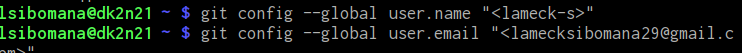{ #fig:003 width=70% }

Настраиваю utf-8 в выводе сообщений git для корректного отображения символов (рис. [-@fig:004]).

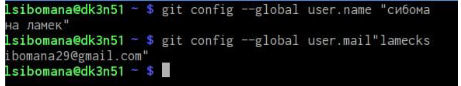{ #fig:004 width=70% }

Задаю имя «master» для начальной ветки (рис. [-@fig:005]).

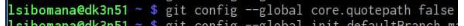{ #fig:005 width=70% }

Задаю параметр autocrlf со значением input, так как я работаю в системе Linux, чтобы конвертировать CRLF в LF только при коммитах (рис. [-@fig:006]). CR и LF – это символы, которые можно использовать для обозначения разрыва строки в текстовых файлах.

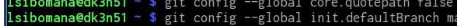{ #fig:006 width=70% }

Задаю параметр safecrlf со значением warn, так Git будет проверять преобразование на обратимость (рис. [-@fig:007]). При значении warn Git только выведет предупреждение, но будет принимать необратимые конвертации.

{ #fig:007 width=70% }

## Создание SSH-ключа

Для последующей идентификации пользователя на сервере репозиториев необходимо сгенерировать пару ключей (приватный и открытый). Для этого ввожу команду ssh-keygen -C "Имя Фамилия, <work@email>", указывая имя владельца и электронную почту владельца (рис. [-@fig:008]). Ключ автоматически сохранится в каталоге ~/.ssh/.

{ #fig:008 width=70% }

Xclip – утилита, позволяющая скопировать любой текст через терминал. Оказывается, в дистрибутиве Linux Kali ее сначала надо установить.
Устанавливаю xclip с помощью команды apt-get install с ключом -y отимени суперпользователя, введя в начале команды sudo (рис. [-@fig:009]).

{ #fig:009 width=70% }

Копирую открытый ключ из директории, в которой он был сохранен, с помощью утилиты xclip (рис. [-@fig:010]).

{ #fig:010 width=70% }

Открываю браузер, захожу на сайт GitHub. Открываю свой профиль и выбираю страницу «SSH and GPG keys». Нажимаю кнопку «New SSH key» (рис. [-@fig:011]).

{ #fig:011 width=70% }

Вставляю скопированный ключ в поле «Key». В поле Title указываю имя для ключа. Нажимаю «Add SSH-key», чтобы завершить добавление ключа (рис. [-@fig:012]).

{ #fig:012 width=70% }

## Создание рабочего пространства и репозитория курса на основе шаблона

Закрываю браузер, открываю терминал. Создаю директорию, рабочее пространство, с помощью утилиты mkdir, блягодаря ключу -p создаю все директории после домашней ~/work/study/2022-2023/"Архитектура компьютера" рекурсивно. Далее проверяю с помощью ls, действительно ли были созданы необходимые мне каталоги (рис. [-@fig:013]).

{ #fig:013 width=70% }

## Создание репозитория курса на основе шаблона

В браузере перехожу на страницу репозитория с шаблоном курса по адресу https://github.com/yamadharma/course-directory-student-template. Далее выбираю «Use this template», чтобы использовать этот шаблон для своего репозитория (рис. [-@fig:014]).

{ #fig:014 width=70% }

В открывшемся окне задаю имя репозитория (Repository name): study_2022–2023_arh-pc и создаю репозиторий, нажимаю на кнопку «Create repository from template» (рис. [-@fig:015]). 

{ #fig:015 width=70% }

Репозиторий создан (рис. [-@fig:016]).

{ #fig:016 width=70% }

Через терминал перехожу в созданный каталог курса с помощью утилиты cd (рис. [-@fig:017]).

{ #fig:017 width=70% }

Клонирую созданный репозиторий с помощью команды git clone –recursive git@github.com:/study_2022–2023_arh-pc.git arch-pc (рис. [-@fig:018]).

{ #fig:018 width=70% }

Копирую ссылку для клонирования на странице созданного репозитория, сначала перейдя в окно «code», далее выбрав в окне вкладку «SSH» (рис. [-@fig:019]).

{ #fig:019 width=70% }

## Настройка каталога курса

Перехожу в каталог arch-pc с помощью утилиты cd (рис. [-@fig:020]).

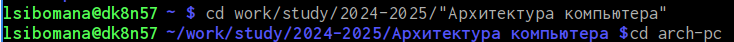{ #fig:020 width=70% }

Удаляю лишние файлы с помощью утилиты rm (рис. [-@fig:021]).

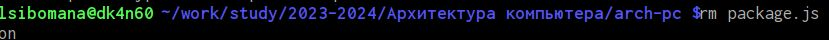{ #fig:021 width=70% }

Создаю необходимые каталоги (рис. [-@fig:022]).

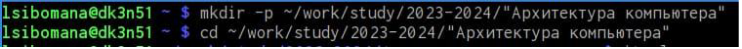{ #fig:022 width=70% }

Отправляю созданные каталоги с локального репозитория на сервер: добавляю все созданные каталоги с помощью git add, комментирую и сохраняю изменения на сервере как добавление курса с помощью git commit (рис. [-@fig:023]).

{ #fig:023 width=70% }

Отправляю все на сервер с помощью push (рис. [-@fig:024]).

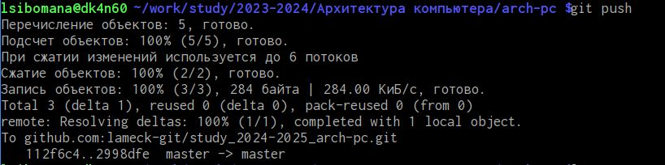{ #fig:024 width=70% }

Проверяю правильность выполнения работы сначала на самом сайте GitHub (рис. [-@fig:025]).

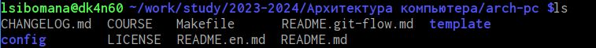{ #fig:025 width=70% }

## Выполнение заданий для самостоятельной работы

1. Перехожу в директорию labs/lab03/report с помощью утилиты cd. Создаю в каталоге файл для отчета по третьей лабораторной работе с помощью утилиты touch (рис. [-@fig:027]).

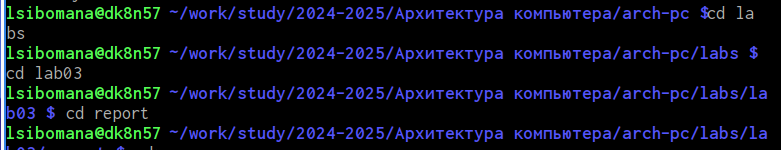{ #fig:027 width=70% }

Оформить отчет я смогу в текстовом процессоре LibreOffice Writer, найдя его в меню приложений (рис. [-@fig:028]).

{ #fig:028 width=70% }+

После открытия текстового процессора открываю в нем созданный файл и могу начать в нем работу над отчетом (рис. [-@fig:030]).

{ #fig:030 width=70% }

2. Перехожу из подкаталога lab03/report в подкаталог lab01/report с помощью утилиты cd (рис. [-@fig:031]).

{ #fig:031 width=70% }

Проверяю местонахождение файлов с отчетами по первой и второй лабораторным работам. Они должны быть в подкаталоге домашней директории «Загрузки», для проверки использую команду ls (рис. [-@fig:032]).

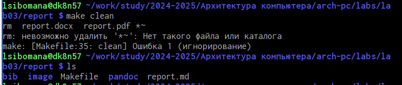{ #fig:032 width=70% }

Копирую первую лабораторную с помощью утилиты cp и проверяю правильность выполнения команды cp с помощью ls (рис. [-@fig:033]).

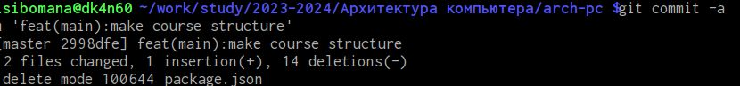{ #fig:033 width=70% }

Перехожу из подкаталога lab01/report в подкаталог lab02/report с помощью утилиты cd (рис. [-@fig:034]).

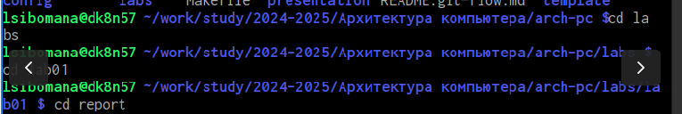{ #fig:034 width=70% }

Копирую вторую лабораторную с помощью утилиты cp и проверяю правильность выполнения команды cp с помощью ls (рис. [-@fig:035]).

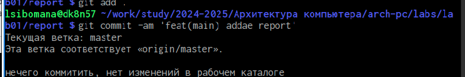{ #fig:035 width=70% }

3. Добавляю с помощью команды git add в коммит созданные файлы: Л02_Дворкина отчет (рис. [-@fig:036]). 
и

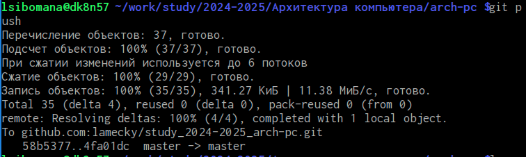{ #fig:036 width=70% }

Вижу, что отчеты по лабораторным работам находятся в соответствующих каталогах репозитория: отчет по первой - в lab01/report (рис. [-@fig:037]), по второй – в lab02/report (рис. [-@fig:038]), по третьей в - lab03/report (рис. [-@fig:039]).

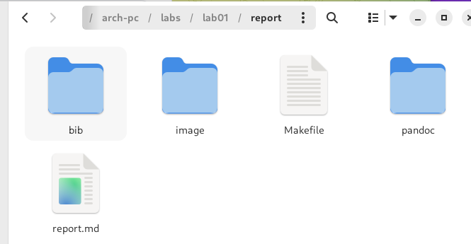{ #fig:037 width=70% }

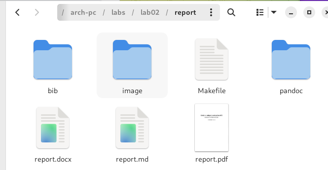{ #fig:038 width=70% }

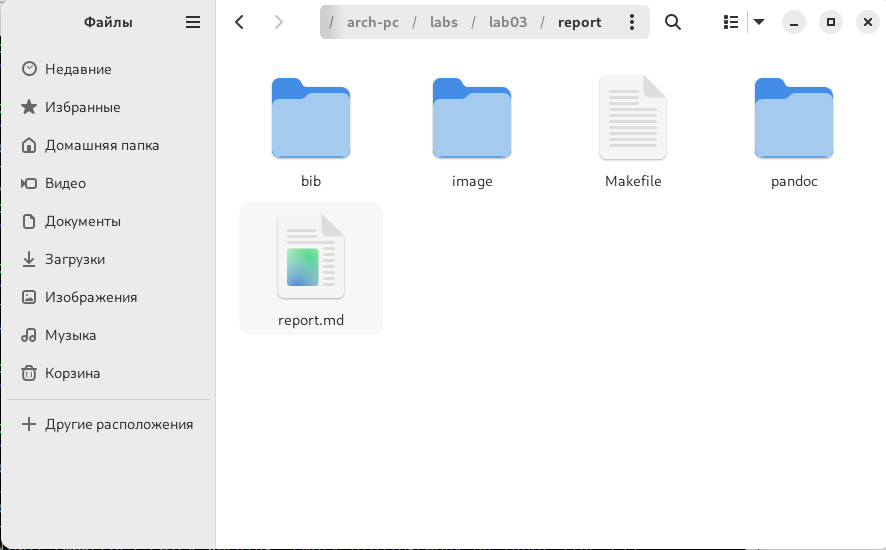{ #fig:039 width=70% }

# Выводы

При выполнении данной лабораторной работы я изучила идеологию и применение средств контроля версий, а также приобрела практические навыки по работе с системой git.

