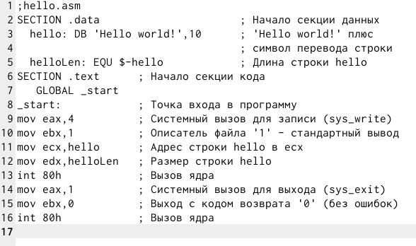
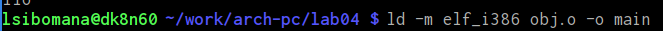

---
## Front matter
title: "Лабораторная работа №4"
subtitle: "Архитектура компьютера"
author: "сибомана ламек"

## Generic otions
lang: ru-RU
toc-title: "Содержание"

## Bibliography
bibliography: bib/cite.bib
csl: pandoc/csl/gost-r-7-0-5-2008-numeric.csl

## Pdf output format
toc: true # Table of contents
toc-depth: 2
fontsize: 12pt
linestretch: 1.5
papersize: a4
documentclass: scrreprt
## I18n polyglossia
polyglossia-lang:
  name: russian
  options:
	- spelling=modern
	- babelshorthands=true
polyglossia-otherlangs:
  name: english
## I18n babel
babel-lang: russian
babel-otherlangs: english
## Fonts
mainfont: IBM Plex Serif
romanfont: IBM Plex Serif
sansfont: IBM Plex Sans
monofont: IBM Plex Mono
mathfont: STIX Two Math
mainfontoptions: Ligatures=Common,Ligatures=TeX,Scale=0.94
romanfontoptions: Ligatures=Common,Ligatures=TeX,Scale=0.94
sansfontoptions: Ligatures=Common,Ligatures=TeX,Scale=MatchLowercase,Scale=0.94
monofontoptions: Scale=MatchLowercase,Scale=0.94,FakeStretch=0.9
mathfontoptions:
## Biblatex
biblatex: true
biblio-style: "gost-numeric"
biblatexoptions:
  - parentracker=true
  - backend=biber
  - hyperref=auto
  - language=auto
  - autolang=other*
  - citestyle=gost-numeric
## Pandoc-crossref LaTeX customization
figureTitle: "Рис."
tableTitle: "Таблица"

## Misc options
indent: true
header-includes:
  - \usepackage{indentfirst}
  - \usepackage{float} # keep figures where there are in the text
  - \floatplacement{figure}{H} # keep figures where there are in the text
---

# Цель работы

Изучение процесса компиляции и сборки программ на ассемблере NASM.

# Задание

Этот практикум посвящена освоению языка ассемблера NASM. В ходе лабораторного работы мы познакомимся с основами программирования на ассемблере NASM. Мы создадим программу "Hello world!", узнаем, как работает транслятор NASM, освоим расширенные возможности командной строки NASM, научимся использовать компоновщик LD и запускать получившийся исполняемый файл.

# Выполнение лабораторной работы

Создадим каталог для работы с программами на языке ассемблера NASM, затем перейдём в него (рис. [-@fig:101]).

{#fig:1 width=70%}

Создадим текстовый файл с именем hello.asm (рис. [-@fig:2]).

{#fig:102 width=70%}

Откроем этот файл с помощью gedit (рис. [-@fig:3]).

{#fig:103 width=70%}

Введём в созданный текстовый файл текст (рис. [-@fig:4]).

{#fig:104 width=70%}

Компилируем текст программы «Hello World» (рис. [-@fig:5]).

{#fig:5 width=70%}

Скомпилируем исходный файл hello.asm в obj.o  (рис. [-@fig:6]).

{#fig:106 width=70%}

Передадим на обработку компоновщику объектный файл необходимо, чтобы получить исполняемую программу (рис. [-@fig:107]).

{#fig:7 width=70%}

Ключ -o с последующим значением задаёт имя создаваемого исполняемого файла.
Выполним следующую команду (рис. [-@fig:108]):

{#fig:8 width=70%}

Запустим на выполнение созданный исполняемый файл, находящийся в текущем каталоге (рис. [-@fig:9]).

{#fig:9 width=70%}

В каталоге ~/work/arch-pc/lab04 с помощью команды cp создадим копию файла
hello.asm с именем lab4.asm (рис. [-@fig:10]).

{#fig:110 width=70%}

С помощью gedit внесём изменения в текст программы в файле lab4.asm так, чтобы вместо Hello world! на экран выводилась строка с фамилией и именем (рис. [-@fig:111]).

{#fig:111 width=70%}

Оттранслируем полученный текст программы lab4.asm в объектный файл (рис. [-@fig:112]). Выполняем
компоновку объектного файла и запустите получившийся исполняемый файл (рис. [-@fig:113]).

{#fig:112 width=70%}

{#fig:113 width=70%}

Скопируем файлы hello.asm и lab4.asm в локальный репозиторий в каталог ~/work/study/2023-2024/"Архитектура компьютера"/arch-pc/labs/lab04/ (рис. [-@fig:114]).

{#fig:114 width=70%}

Загрузим файлы на Github (рис. [-@fig:115]) и (рис. [-@fig:116]).

{#fig:115 width=70%}

{#fig:116 width=70%}

# Выводы

В ходе лабораторной работы мы получили практические навыки работы с ассемблером NASM, создали программу "Hello world!", изучили процесс компиляции и сборки с помощью транслятора NASM и компоновщика LD, а также разобрались с расширенными возможностями командной строки NASM.

