---
## Front matter
title: "Лабораторная работа №7"
subtitle: "Команды безусловного и условного переходов в Nasm. Программирование ветвлений"
author: "СИБОМАНА Ламек"

## Generic otions
lang: ru-RU
toc-title: "Содержание"

## Bibliography
bibliography: bib/cite.bib
csl: pandoc/csl/gost-r-7-0-5-2008-numeric.csl

## Pdf output format
toc: true # Table of contents
toc-depth: 2
fontsize: 12pt
linestretch: 1.5
papersize: a4
documentclass: scrreprt
## I18n polyglossia
polyglossia-lang:
  name: russian
  options:
	- spelling=modern
	- babelshorthands=true
polyglossia-otherlangs:
  name: english
## I18n babel
babel-lang: russian
babel-otherlangs: english
## Fonts
mainfont: IBM Plex Serif
romanfont: IBM Plex Serif
sansfont: IBM Plex Sans
monofont: IBM Plex Mono
mathfont: STIX Two Math
mainfontoptions: Ligatures=Common,Ligatures=TeX,Scale=0.94
romanfontoptions: Ligatures=Common,Ligatures=TeX,Scale=0.94
sansfontoptions: Ligatures=Common,Ligatures=TeX,Scale=MatchLowercase,Scale=0.94
monofontoptions: Scale=MatchLowercase,Scale=0.94,FakeStretch=0.9
mathfontoptions:
## Biblatex
biblatex: true
biblio-style: "gost-numeric"
biblatexoptions:
  - parentracker=true
  - backend=biber
  - hyperref=auto
  - language=auto
  - autolang=other*
  - citestyle=gost-numeric
## Pandoc-crossref LaTeX customization
figureTitle: "Рис."
tableTitle: "Таблица"
listingTitle: "Листинг"
lolTitle: "Листинги"
## Misc options
indent: true
header-includes:
  - \usepackage{indentfirst}
  - \usepackage{float} # keep figures where there are in the text
  - \floatplacement{figure}{H} # keep figures where there are in the text
---

# Цель работы

Изучение команд условного и безусловного переходов. Приобретение навыков написания программ с использованием переходов. Знакомство с назначением и структурой файла листинга.

# Выполнение лабораторной работы

1.Сначала я создал каталог для программам лабораторной работы № 7, затем перешел в него и
создал файл lab7-1.asm

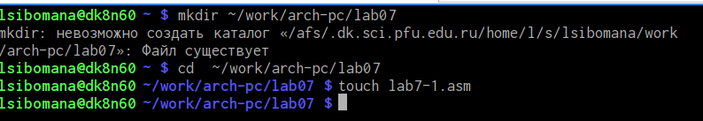{#fig:001 width=70%}

2. Я Открывал файл в Midnight Commander и  ввёл в файл lab7-1.asm текст программы из листинга 7.1. 

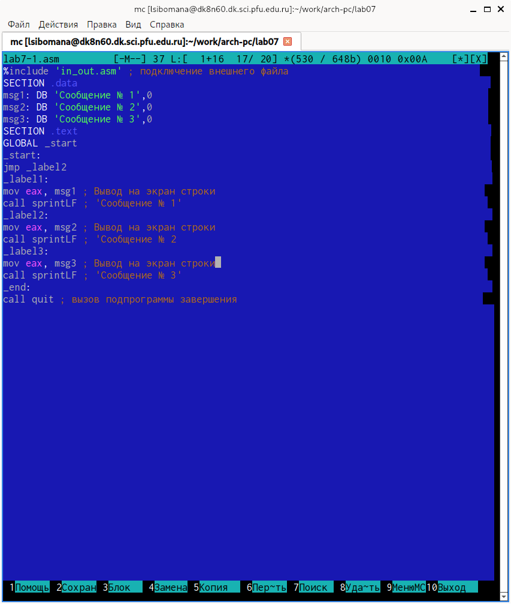{#fig:002 width=70%}

Я создал исполняемый файл и запустил его

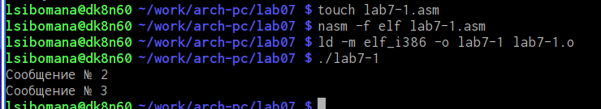{#fig:003 width=70%}

Я изменил программу таким образом, чтобы она выводил сначала ‘Сообщение № 2’, потом ‘Сообщение
№ 1’ и завершала работу в соответствии с листингом 7.2.

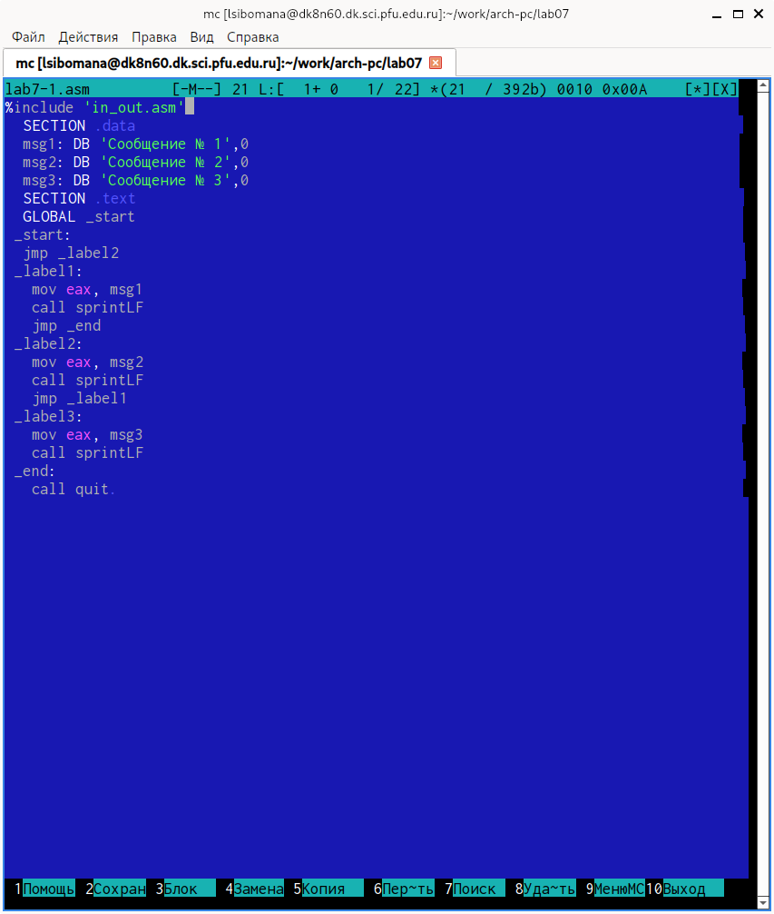{#fig:004 width=70%}

Затем я создал и проверил измененный файл.

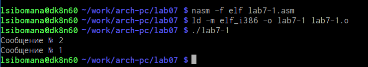{#fig:005 width=70%}

Теперь изменим текст программы изменив инструкции jmp, чтобы при выводе программы была такая последовательность сообщений: №3, №2, №1ю

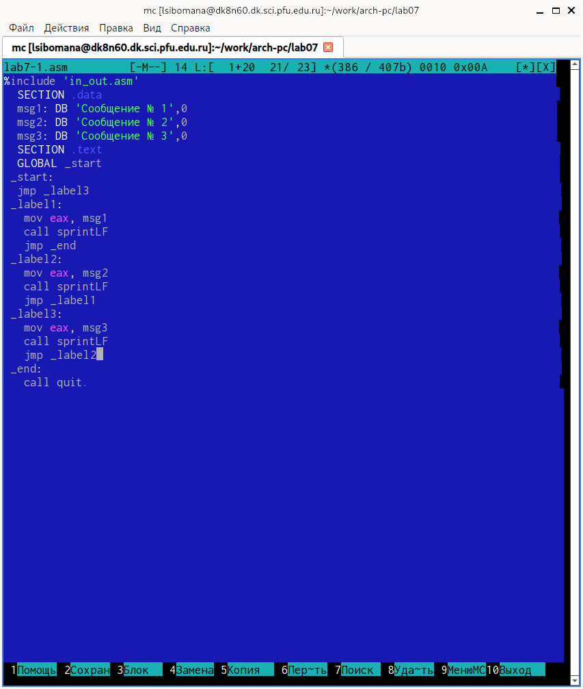{#fig:006 width=70%}

Затем я создал и проверил измененный файл.

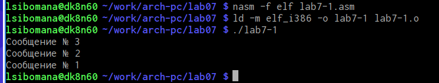{#fig:007 width=70%}

3. Я создал файл lab7-2.asm в каталоге ~/work/arch-pc/lab07 и ввела в него текст программы из листинга 7.3.

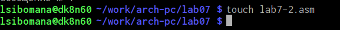{#fig:008 width=70%}

Открываем файл в Midnight Commander и заполняем его в соответствии с листингом 7.3.
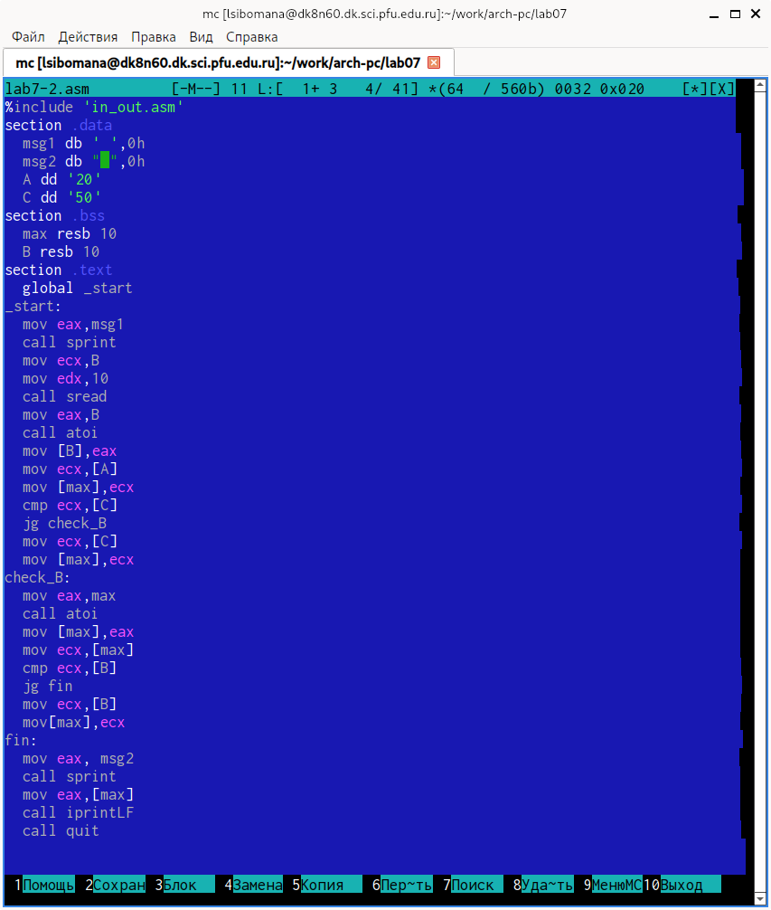{#fig:009 width=70%}

Затем я создал и проверил работу файла для 1, 100, 49.

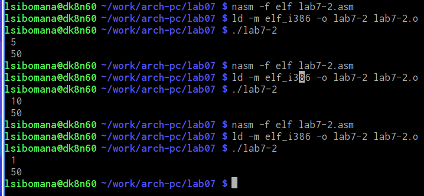{#fig:010 width=70%}

4. Создал файл листинга для программы из файла lab7-2.as

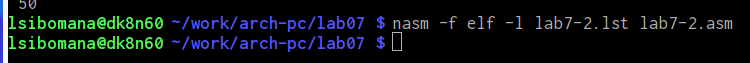{#fig:011 width=70%}

Затем я открыла файл с помощью mcedit.

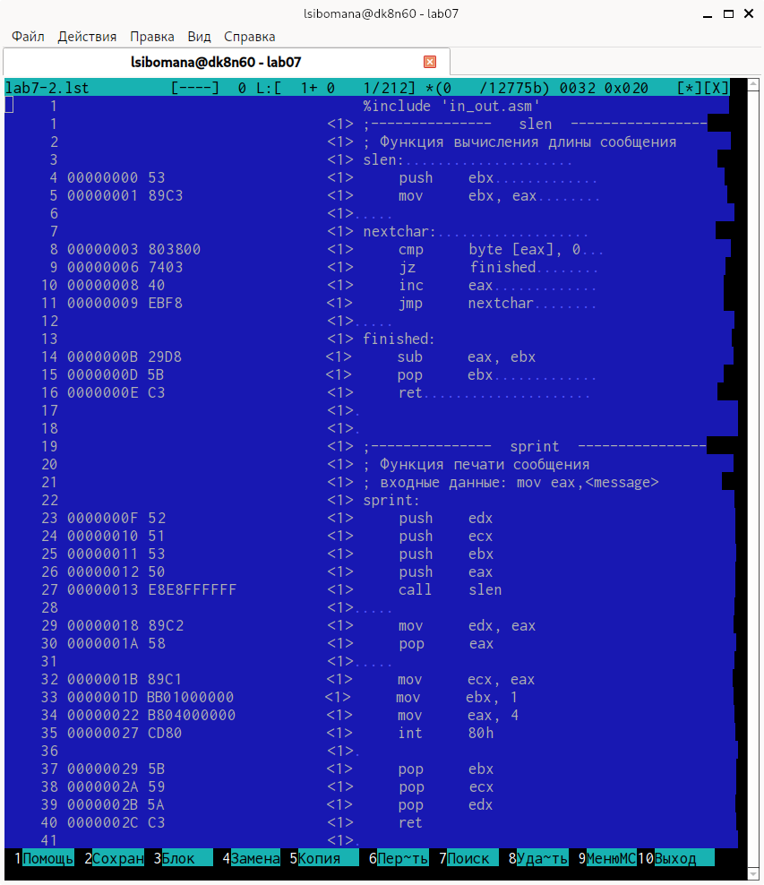{#fig:012 width=70%}

Я подробно изучил содержимое файла и выбрал следующие строки для обьяснения.

1) 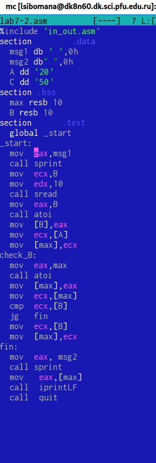{#fig:013 width=70%}

Эта строка находится на 14 месте, 000000E8 - ее адрес, B8[00000000] - машинный код. mov eax,msg1 - это исходный текст программы, означающий что в регистор eax вносится значение msg1, в нашем случае это строка со словами "Введите B:" 

2) 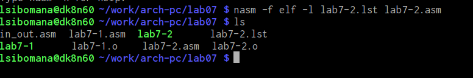{#fig:014 width=70%}

Эта строка находится на 29 месте, 00000018 - ее адрес, 89C2 - машинный код. jg check_B  - это исходный текст программы, означающий что нужно сделать переход на строку check-B если первое число больше второго. Сравнение и определение этих чисел происходят в предыдущих командах.

3)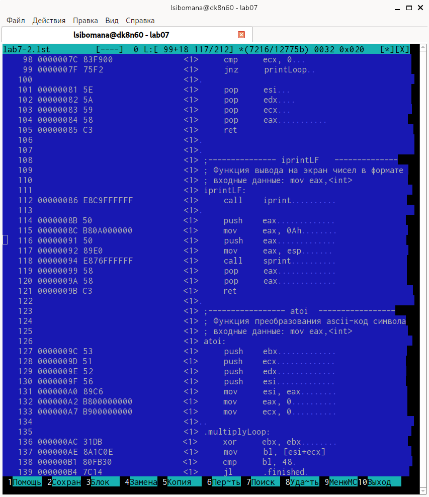{#fig:015 width=70%}

Эта строка находится на 33 месте,0000001D  - ее адрес в сегменте кода, BB01000000-,  - машинный код. mov ebx,1  - это исходный текст программы, означающий что происходит сравнение регистра ecx с значением 1.

Строка 34: 00000022-адрес в сегменте кода, B804000000-машинный код, mov eax,4-присвоение переменной eax значения 4.

Затем я снова открыл с программой lab7-2.asm и удалил один операнд в инструкции с двумя операндами.
Строка 35 00000027-адрес в сегменте кода, CD80-машинный код, int 80h-вызов ядра.

# Выполнение самостоятельной работы
ВАРИАНТ-05
1. Я создала файл var-5, в котором написала программу нахождения наименьшей из 3 целочисленных переменных 𝑎,𝑏 и _c_. В моей программе значения переменных вводятся вручную с клавиатуры. Мой вариант - 5

Создаем новый файл .

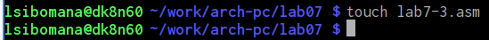{#fig:0016 width=70%}

Открываем его и пишем программу, которая выберет наименбшее число из трех(2 числа уже в программе, 3е вводится из консоли)

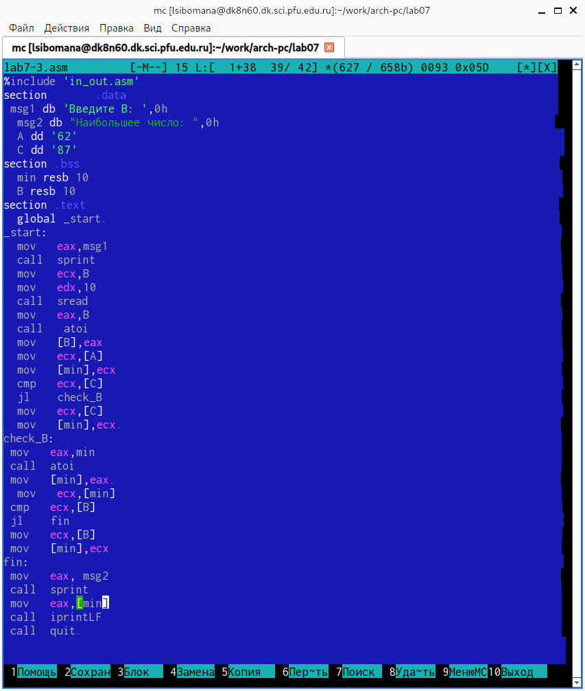{#fig:017 width=70%}

Транслировал файл и смотрим на работу программы.

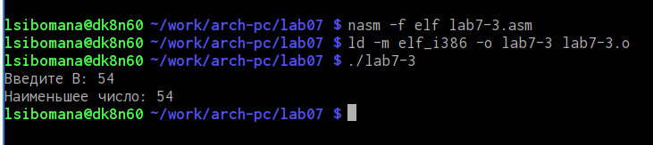{#fig:018 width=70%}

2. Я создала файл var1-2, в который написала программу, которая для введенных с клавиатуры значений 𝑥 и 𝑎 вычисляет значение заданной функции 𝑓(𝑥) и выводит результат вычислений.
Создал новый файл.

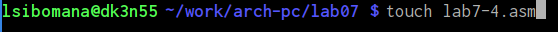{#fig:019 width=70%}
 
Затем я проверил работу команды. Мой вариант - 5, поэтому я ввела значения 54,62,87.

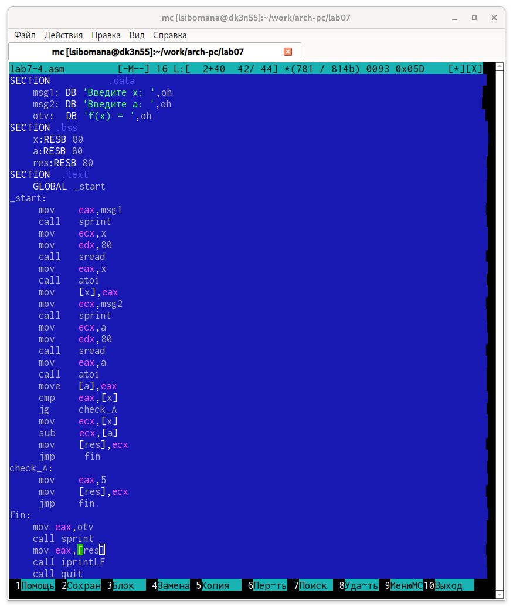{#fig:020 width=70%}

 Я создала файл var1-2, в который написала программу, которая для введенных с клавиатуры значений 𝑥 и 𝑎 вычисляет значение заданной функции 𝑓(𝑥) и выводит результат вычислений.

Транслируем файл и проверяем его работу при x=1 и а=2(#fig:021
Проверяем работу программы

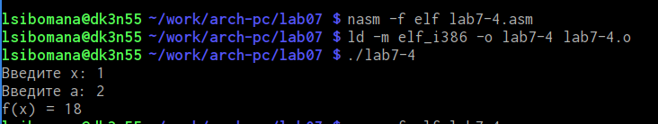{#fig:021 width=70%}

Транслируем файл и проверяем его работу при x=1 и а=2(#fig:021)

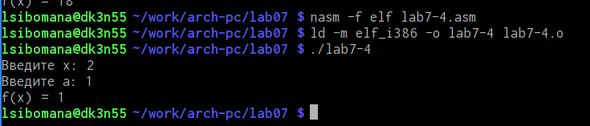{#fig:022 width=70%}

Затем я создал и проверил работу файла. Ввёл такие значения(𝑥2,𝑎2)=(2;1)
Транслируем файл и проверяем его работу при x=2 и а=1

{#fig:023 width=70%}

# Выводы

В ходе лабораторной работы мной были изучены команды условного и безусловного переходов, навыки написания программ с их использованием. А также я познакомился с назначением и структурой файла
листинга.

