---
## Front matter
title: "Отчёта по лабораторной работе №8"
subtitle: "Программирование цикла. Обработка аргументов командной строки."
author: "сибомана Ламек  НКАбд-03-24"

## Generic otions
lang: ru-RU
toc-title: "Содержание"

## Bibliography
bibliography: bib/cite.bib
csl: pandoc/csl/gost-r-7-0-5-2008-numeric.csl

## Pdf output format
toc: true # Table of contents
toc-depth: 2
lof: true # List of figures
lot: true # List of tables
fontsize: 12pt
linestretch: 1.5
papersize: a4
documentclass: scrreprt
## I18n polyglossia
polyglossia-lang:
  name: russian
  options:
	- spelling=modern
	- babelshorthands=true
polyglossia-otherlangs:
  name: english
## I18n babel
babel-lang: russian
babel-otherlangs: english
## Fonts
mainfont: IBM Plex Serif
romanfont: IBM Plex Serif
sansfont: IBM Plex Sans
monofont: IBM Plex Mono
mathfont: STIX Two Math
mainfontoptions: Ligatures=Common,Ligatures=TeX,Scale=0.94
romanfontoptions: Ligatures=Common,Ligatures=TeX,Scale=0.94
sansfontoptions: Ligatures=Common,Ligatures=TeX,Scale=MatchLowercase,Scale=0.94
monofontoptions: Scale=MatchLowercase,Scale=0.94,FakeStretch=0.9
mathfontoptions:
## Biblatex
biblatex: true
biblio-style: "gost-numeric"
biblatexoptions:
  - parentracker=true
  - backend=biber
  - hyperref=auto
  - language=auto
  - autolang=other*
  - citestyle=gost-numeric
## Pandoc-crossref LaTeX customization
figureTitle: "Рис."
tableTitle: "Таблица"
listingTitle: "Листинг"
lofTitle: "Список иллюстраций"
lotTitle: "Список таблиц"
lolTitle: "Листинги"
## Misc options
indent: true
header-includes:
  - \usepackage{indentfirst}
  - \usepackage{float} # keep figures where there are in the text
  - \floatplacement{figure}{H} # keep figures where there are in the text
---

# Цель работы
Приобретение навыков написания программ с использованием циклов и обработкой
аргументов командной строки.

# Теоретическое введение

  Стек — это структура данных, организованная по принципу LIFO («Last In — First Out»
или «последним пришёл — первым ушёл»). Стек является частью архитектуры процессора и
реализован на аппаратном уровне. Для работы со стеком в процессоре есть специальные
регистры (ss, bp, sp) и команды.
Основной функцией стека является функция сохранения адресов возврата и передачи
аргументов при вызове процедур. Кроме того, в нём выделяется память для локальных
переменных и могут временно храниться значения регистров.
На рис. 8.1 показана схема организации стека в процессоре.
Стек имеет вершину, адрес последнего добавленного элемента, который хранится в ре-
гистре esp (указатель стека). Противоположный конец стека называется дном. Значение,
помещённое в стек последним, извлекается первым. При помещении значения в стек указа-
тель стека уменьшается, а при извлечении — увеличивается.
Для стека существует две основные операции:
• добавление элемента в вершину стека (push);
• извлечение элемента из вершины стека (pop).                                             |

# Выполнение лабораторной работы
1.Сначала я создал каталог для программам лабораторной работы № 8, затем перешёл в него и
создал файл lab8-1.asm(рис. [@fig:001])
![Создание каталога и файла lab8-1] (image/1.png){#fig:001 width=70%}

Открывал файл в Midnight Commander и заполняем его в соответствии с листингом 8.1 (рис. [@fig:002]).

![Текст программы lab8-1.asm] (image/2.png){#fig:002 width=70%}

 Создал исполняемый файл и проверьте его работу.
 
 ![Создание и запуск lab8-1.asm]image/3.png){#fig:003 width=70%}

Изменил текст программы добавив изменение
значение регистра ecx в циклеСнова открывал файл для редактирования и изменяем его, добавив изменение значения регистра в цикле (рис. [@fig:004])

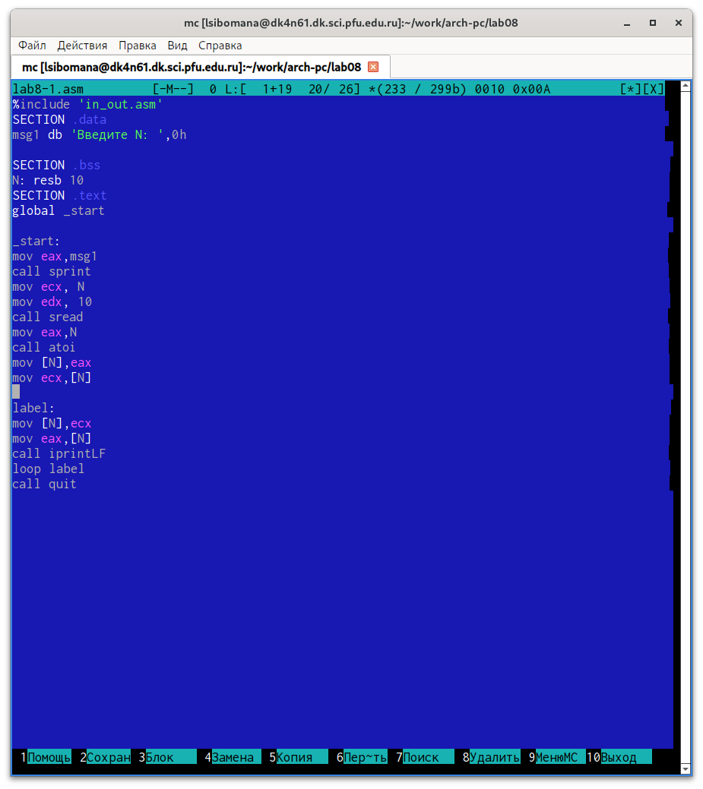{#fig:004 width=70}

Создаем исполняемый файл и запускаем его (рис. [@fig:005]).

![Создание и запуск lab8-1.asm]image/5.png){#fig:005 width=70%}

Регистр ecx принимает значения 9,7,5,3,1(на вход подается число 10, в цикле label данный регистр уменьшается на 2 командой sub и loop).

Число проходов цикла не соответсвует числу N, так как уменьшается на 2.

Снова открываем файл для редактирования и изменяем его, чтобы все корректно работало (рис.[ @fig:006]).

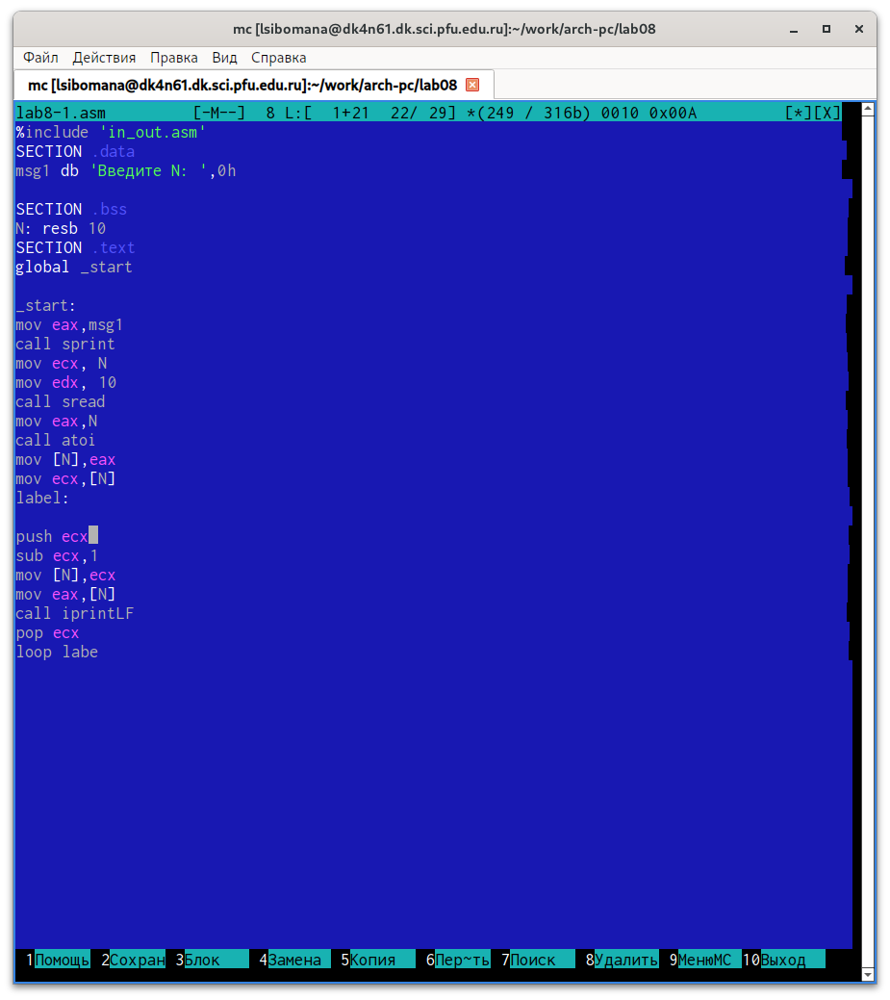{#fig:006 width=70}

Создаем исполняемый файл и запускаем его (рис. [@fig:007]).

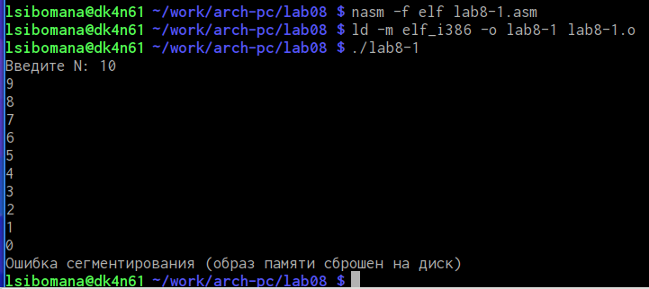{#fig:007 width=70%}

В данном случае число проходов цикла равна числу N.

ОБРАБОТКА АРГУМЕНТОВ КОМАНДНОЙ СТРОКИ

Создаем новый файл (рис.[ @fig:008]).

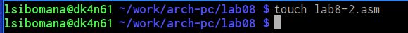{#fig:008 width=70%}

Открываем файл в Midnight Commander и заполняем его в соответствии с листингом 8.2 (рис.[ @fig:009]).

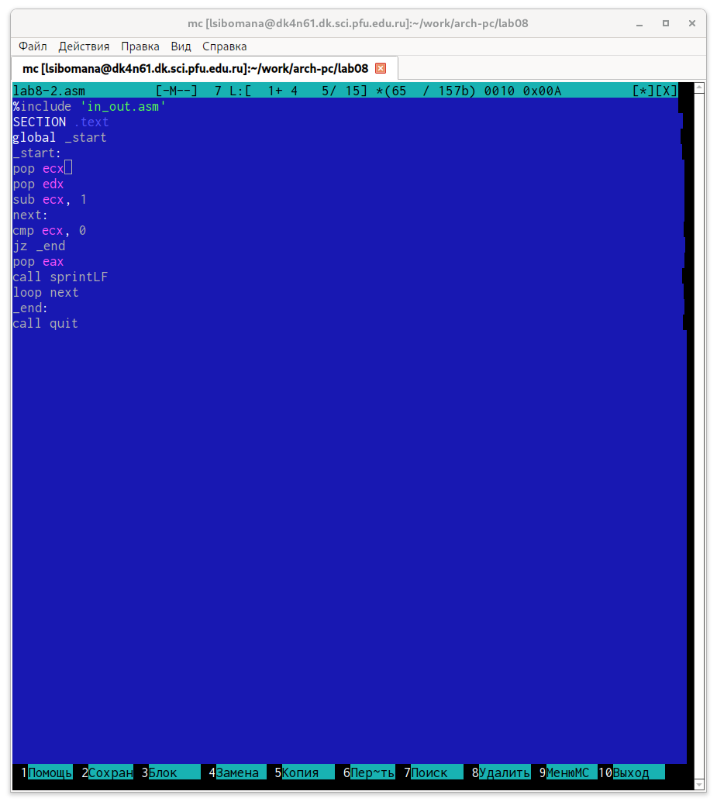{#fig:009 width=70}

Создаем исполняемый файл и проверяем его работу, указав аргументы (рис.[@fig:010]).

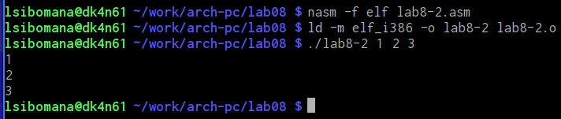{#fig:0010 width=70%}

Програмой было обработано 3 аргумента.

Создаем новый файл lab8-3.asm (рис. [@fig:011]).

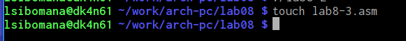{#fig:0011 width=70%}

Открываем файл и заполняем его в соответствии с листингом 8.3 (рис. @fig:012)

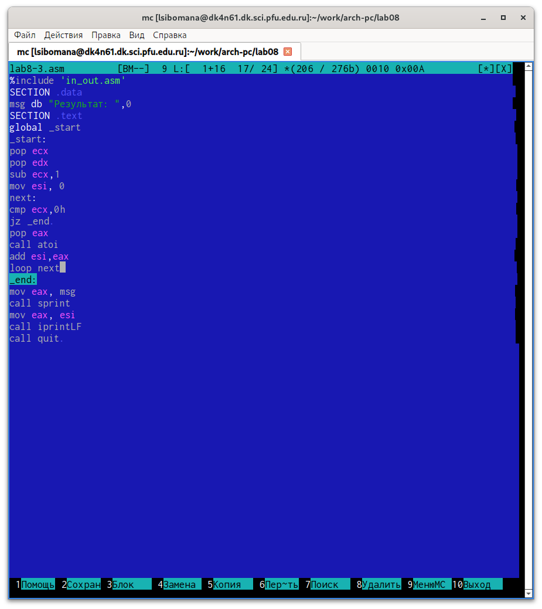{#fig:0012 width=70%}

Создаём исполняемый файл и запускаем его, указав аргументы (рис. [@fig:013]).

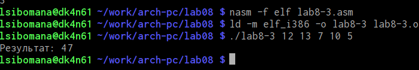{#fig:0013 width=70%}

Снова открываем файл для редактирования и изменяем его, чтобы вычислялось произведение вводимых значений (рис. [@fig:014])

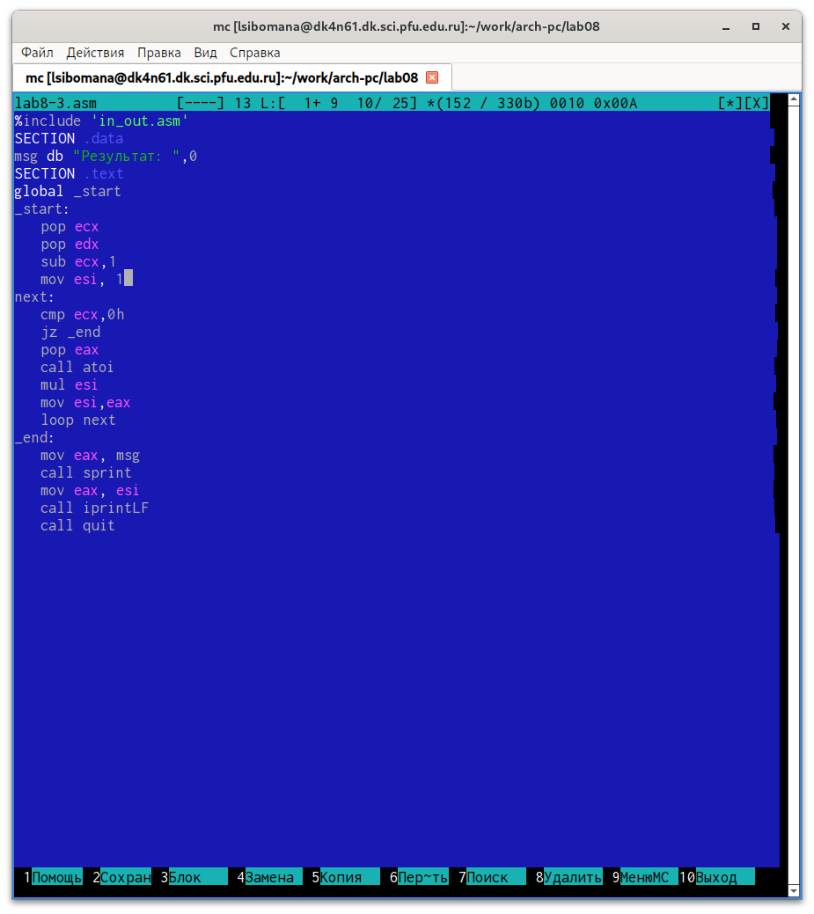{#fig:0014 width=70%}

Создаём исполняемый файл и запускаем его, указав аргументы (рис. [@fig:015]).

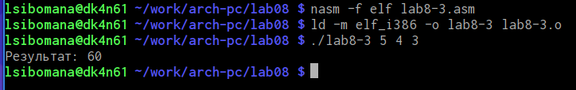{#fig:0015 width=70%}

ЗАДАНИЕ ДЛЯ САМОСТОЯТЕЛЬНОЙ РАБОТЫ

ВАРИАНТ-5

    Напишите программу, которая находит сумму значений функции 𝑓(𝑥) для 𝑥 = 𝑥1, 𝑥2, ..., 𝑥𝑛, т.е. программа должна выводить значение 𝑓(𝑥1) + 𝑓(𝑥2) + ... + 𝑓(𝑥𝑛). Значения 𝑥𝑖 передаются как аргументы. Вид функции 𝑓(𝑥) выбрать из таблицы 8.1 вариантов заданий в соответствии с вариантом, полученным при выполнении лабораторной работы № 7. Создайте исполняемый файл и проверьте его работу на нескольких наборах 𝑥 = 𝑥1, 𝑥2, ..., 𝑥𝑛.

Создаем новый файл (рис.[@fig:016]).

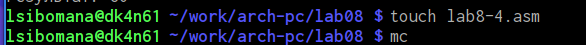{#fig:0016 width=70%}

Открываем его и пишем программу, которая выведет сумму значений, получившихся после решения выражения 4𝑥 + 3 (рис. [@fig:017]).

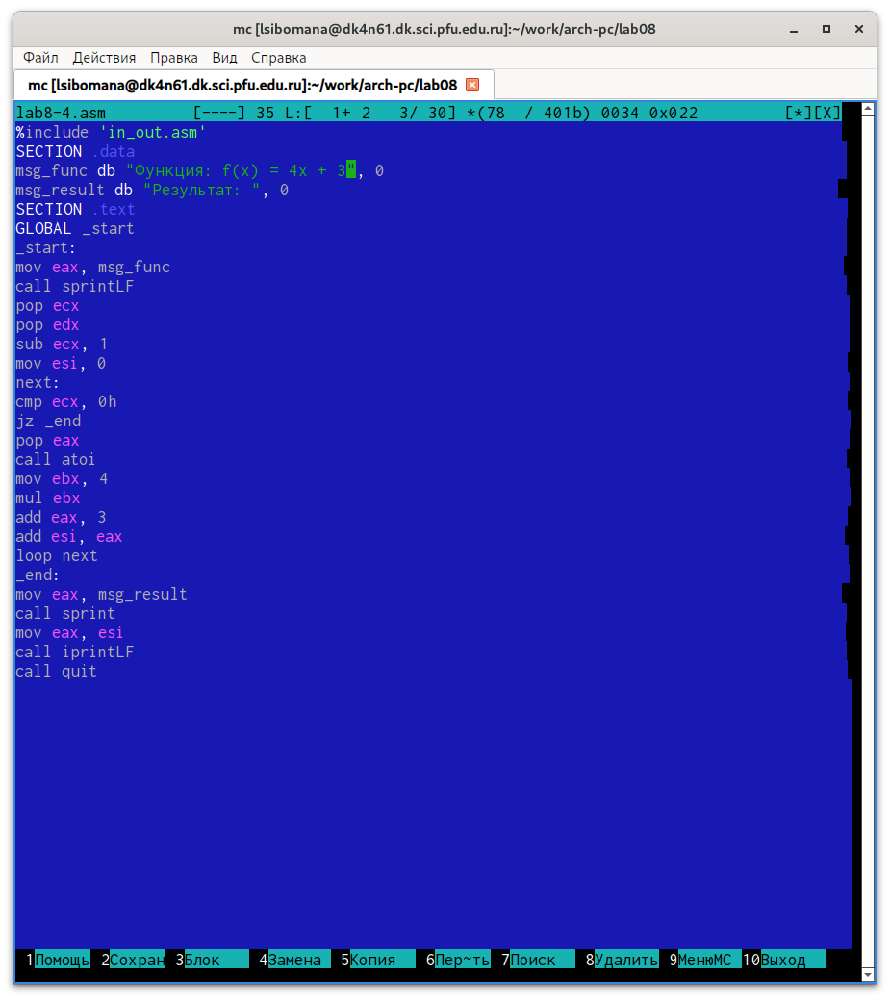{#fig:0017width=70%}

Транслируем файл и смотрим на работу программы (рис. [@fig:018]).

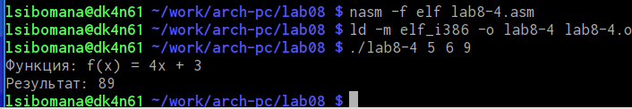{#fig:0018 width=70%}

Транслируем файл и смотрим на работу программы (рис. [@fig:019]).

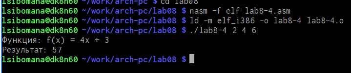{#fig:0019 width=70%}

# Выводы
Мы научились решать программы с использованием циклов и обработкой аргументов командной строки.

