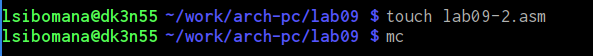

---
## Front matter
title: "Отчёта по лабораторной работе №9"
subtitle: "Понятие подпрограммы. Отладчик GDB."
author: "Сибомана Ламек  НКАбд-03-24"

## Generic otions
lang: ru-RU
toc-title: "Содержание"

## Bibliography
bibliography: bib/cite.bib
csl: pandoc/csl/gost-r-7-0-5-2008-numeric.csl

## Pdf output format
toc: true # Table of contents
toc-depth: 2
lof: true # List of figures
lot: true # List of tables
fontsize: 12pt
linestretch: 1.5
papersize: a4
documentclass: scrreprt
## I18n polyglossia
polyglossia-lang:
  name: russian
  options:
	- spelling=modern
	- babelshorthands=true
polyglossia-otherlangs:
  name: english
## I18n babel
babel-lang: russian
babel-otherlangs: english
## Fonts
mainfont: IBM Plex Serif
romanfont: IBM Plex Serif
sansfont: IBM Plex Sans
monofont: IBM Plex Mono
mathfont: STIX Two Math
mainfontoptions: Ligatures=Common,Ligatures=TeX,Scale=0.94
romanfontoptions: Ligatures=Common,Ligatures=TeX,Scale=0.94
sansfontoptions: Ligatures=Common,Ligatures=TeX,Scale=MatchLowercase,Scale=0.94
monofontoptions: Scale=MatchLowercase,Scale=0.94,FakeStretch=0.9
mathfontoptions:
## Biblatex
biblatex: true
biblio-style: "gost-numeric"
biblatexoptions:
  - parentracker=true
  - backend=biber
  - hyperref=auto
  - language=auto
  - autolang=other*
  - citestyle=gost-numeric
## Pandoc-crossref LaTeX customization
figureTitle: "Рис."
tableTitle: "Таблица"
listingTitle: "Листинг"
lofTitle: "Список иллюстраций"
lotTitle: "Список таблиц"
lolTitle: "Листинги"
## Misc options
indent: true
header-includes:
  - \usepackage{indentfirst}
  - \usepackage{float} # keep figures where there are in the text
  - \floatplacement{figure}{H} # keep figures where there are in the text
---

# Цель работы
Приобретение навыков написания программ с использованием циклов и обработкой
аргументов командной строки.

# Теоретическое введение

###Понятие об отладке
 
**Отладка** — это процесс поиска и исправления ошибок в программе. В общем случае его
можно разделить на четыре этапа:
• обнаружение ошибки;
• поиск её местонахождения;
• определение причины ошибки;
• исправление ошибки.
Можно выделить следующие типы ошибок:
• синтаксические ошибки — обнаруживаются во время трансляции исходного кода и
вызваны нарушением ожидаемой формы или структуры языка;
• семантические ошибки — являются логическими и приводят к тому, что программа
запускается, отрабатывает, но не даёт желаемого результата;
• ошибки в процессе выполнения — не обнаруживаются при трансляции и вызывают пре-
рывание выполнения программы (например, это ошибки, связанные с переполнением
или делением на ноль).
Второй этап — поиск местонахождения ошибки. Некоторые ошибки обнаружить доволь-
но трудно. Лучший способ найти место в программе, где находится ошибка, это разбить
программу на части и произвести их отладку отдельно друг от друга.
Третий этап — выяснение причины ошибки. После определения местонахождения ошибки
обычно проще определить причину неправильной работы программы.
Последний этап — исправление ошибки. После этого при повторном запуске программы,
может обнаружиться следующая ошибка, и процесс отладки начнётся заново.                                    |

###Методы отладки
Наиболее часто применяют следующие методы отладки:
• создание точек контроля значений на входе и выходе участка программы (например,
вывод промежуточных значений на экран — так называемые диагностические сообще-
ния);
• использование специальных программ-отладчиков.
Отладчики позволяют управлять ходом выполнения программы, контролировать и из-
менять данные. Это помогает быстрее найти место ошибки в программе и ускорить её
исправление. Наиболее популярные способы работы с отладчиком — это использование
точек останова и выполнение программы по шагам.
Пошаговое выполнение — это выполнение программы с остановкой после каждой строчки,
чтобы программист мог проверить значения переменных и выполнить другие действия.
Точки останова — это специально отмеченные места в программе, в которых программа-
отладчик приостанавливает выполнение программы и ждёт команд. Наиболее популярные
виды точек останова:
• Breakpoint — точка останова (остановка происходит, когда выполнение доходит до
определённой строки, адреса или процедуры, отмеченной программистом);
• Watchpoint — точка просмотра (выполнение программы приостанавливается, если
программа обратилась к определённой переменной: либо считала её значение, либо
изменила его).
Точки останова устанавливаются в отладчике на время сеанса работы с кодом програм-
мы, т.е. они сохраняются до выхода из программы-отладчика или до смены отлаживаемой
программы.

# Выполнение лабораторной работы

##Реализация подпрограмм в NASM

1.Сначала я создал каталог для программам лабораторной работы №9, затем перешёл в него и
создал файл lab09-1.asm(рис. [@fig:001])
![Создание каталога и файла lab09-1.asm] (image/1.png){#fig:001 width=70%}

Открывал файл в Midnight Commander и заполняем его в соответствии с листингом 9.1 (рис. [@fig:002]).

![Текст программы lab09-1.asm] (image/2.png){#fig:002 width=70%}

 Создал исполняемый файл и проверьте его работу.
 
 ![Создание и запуск lab09-1.asm]image/3.png){#fig:003 width=70%}

Изменил текст программы добавив изменение
значение регистра ecx в циклеСнова открывал файл для редактирования и изменяем его, добавив изменение значения регистра в цикле (рис. [@fig:004])

{#fig:004 width=70}

Создаем исполняемый файл и запускаем его (рис. [@fig:005]).

![Создание и запуск lab09-1.asm]image/5.png){#fig:005 width=70%}

##Отладка программам с помощью GDB

Создаем новый файл в каталоге(рис. @fig:006).
{#fig:006 width=70%}

Создаем исполняемый файл и запускаем его 

{#fig:007 width=70}

Получаем исходный файл с использованием отладчика gdb 

{#fig:008 width=70%}

Запускаем команду в отладчике 

{#fig:009 width=70}

Устанавливаем брейкпоинт на метку _start и запускаем программу

{#fig:0010 width=70%}

Смотрим дисассимилированный код программы с помощью команды disassemble, начиная с метки _start

{#fig:0011 width=70%}

Переключаемся на отображение команд с Intel’овским синтаксисом (рис. @fig:012).

{#fig:0012 width=70%}

Различия отображения синтаксиса машинных команд в режимах ATT и Intel:

1.Порядок операндов: В ATT синтаксисе порядок операндов обратный, сначала указывается исходный операнд, а затем - результирующий операнд. В Intel синтаксисе порядок обычно прямой, результирующий операнд указывается первым, а исходный - вторым.

2.Разделители: В ATT синтаксисе разделители операндов - запятые. В Intel синтаксисе разделители могут быть запятые или косые черты (/).

3.Префиксы размера операндов: В ATT синтаксисе размер операнда указывается перед операндом с использованием префиксов, таких как "b" (byte), "w" (word), "l" (long) и "q" (quadword). В Intel синтаксисе размер операнда указывается после операнда с использованием суффиксов, таких как "b", "w", "d" и "q".

4.Знак операндов: В ATT синтаксисе операнды с позитивными значениями предваряются символом "$". В Intel синтаксисе операнды с позитивными значениями могут быть указаны без символа "$".

5.Обозначение адресов: В ATT синтаксисе адреса указываются в круглых скобках. В Intel синтаксисе адреса указываются без скобок.

6.Обозначение регистров: В ATT синтаксисе обозначение регистра начинается с символа "%". В Intel синтаксисе обозначение регистра может начинаться с символа "R" или "E" (например, "%eax" или "RAX").

Включаем режим псевдографики (рис. @fig:013).

{#fig:0013 width=70%}

Проверяем была ли установлена точка останова и устанавливаем точку останова предпоследней инструкции (рис. @fig:014).

{#fig:0014 width=70%}

Посмотрим информацию о всех установленных точках останова (рис. @fig:015).

{#fig:0015 width=70%}

Выполняем 5 инструкций командой si (рис. @fig:016).

{#fig:0016 width=70%}

Во время выполнения команд менялись регистры: ebx, ecx, edx,eax, eip.

Смотрим значение переменной msg1 по имени (рис. @fig:017).

{#fig:0017width=70%}

Смотрим значение переменной msg2 по адресу (рис. @fig:018).

{#fig:0018 width=70%}

Изменим первый символ переменной msg1 (рис. @fig:019).

Меняем символ

{#fig:0019 width=70%}

Изменим первый символ переменной msg2 (рис. @fig:020).

{#fig:0020 width=70%}

Смотрим значение регистра edx в разных форматах (рис. @fig:021).
{#fig:0021 width=70%}

Изменяем регистор ebx (рис. @fig:022)

{#fig:0022 width=70%}

Выводится разные значения, так как команда без кеавычек присваивает регистру вводимое значение.

Прописываем команды для завершения программы и выхода из GDB (рис. @fig:023).
{#fig:0023 width=70%}

Копируем файл lab8-2.asm в файл с именем lab09-3.asm (рис. @fig:024)

{#fig:0024 width=70%}

Создаем исполняемый файл и запускаем его в отладчике GDB (рис. @fig:025).

{#fig:0025 width=70%}

Установим точку останова перед первой инструкцией в программе и запустим ее (рис. @fig:026).
{#fig:0026 width=70%}
Смотрим позиции стека по разным адресам (рис. @fig:027).

{#fig:0027 width=70%}

Шаг изменения адреса равен 4 потому что адресные регистры имеют размерность 32 бита(4 байта).

##Задание для самостоятельной работы

###Задание 1

Копируем файл lab8-4.asm(ср №1 в ЛБ8) в файл с именем lab09-3.asm (рис. @fig:028).

{#fig:0028 width=70%}

Открываем файл в Midnight Commander и меняем его, создавая подпрограмму (рис. @fig:029).

{#fig:0029 width=70%}

Создаем исполняемый файл и запускаем его (рис. @fig:030).

{#fig:0030 width=70%}
###Задание 2

Создаем новый файл в дирректории (рис. @fig:031).

{#fig:0031 width=70%}

Открываем файл в Midnight Commander и заполняем его в соответствии с листингом 9.3 (рис. @fig:032).

{#fig:0032 width=70%}

Создаем исполняемый файл и запускаем его (рис. @fig:033).

{#fig:0033 width=70%}

Создаем исполняемый файл и запускаем его в отладчике GDB и смотрим на изменение решистров командой si (рис. @fig:034).
{#fig:0034 width=70%}

Изменяем программу для корректной работы (рис. @fig:035).

{#fig:0035 width=70%}

Создаем исполняемый файл и запускаем его (рис. @fig:036).

{#fig:0036 width=70%}

# Выводы

Мы познакомились с методами отладки при помощи GDB и его возможностями.

#Содержание отчёта

Отчёт должен включать:
• Титульный лист с указанием номера лабораторной работы и ФИО студента.
• Формулировка цели работы.
• Описание результатов выполнения лабораторной работы:
– описание выполняемого задания;
– скриншоты (снимки экрана), фиксирующие выполнение заданий лабораторной
работы;
– комментарии и выводы по результатам выполнения заданий.
• Описание результатов выполнения заданий для самостоятельной работы:
– описание выполняемого задания;
– скриншоты (снимки экрана), фиксирующие выполнение заданий;
– комментарии и выводы по результатам выполнения заданий;
– листинги написанных программ (текст программ).
• Выводы, согласованные с целью работы.
Отчёт по выполнению лабораторной работы оформляется в формате Markdown. В качестве
отчёта необходимо предоставить отчёты в 3 форматах: pdf, docx и md. А также файлы с
исходными текстами написанных при выполнении лабораторной работы программ (файлы
*.asm). Файлы необходимо загрузить на странице курса в ТУИС в задание к соответствующей
лабораторной работе и загрузить на Github.

