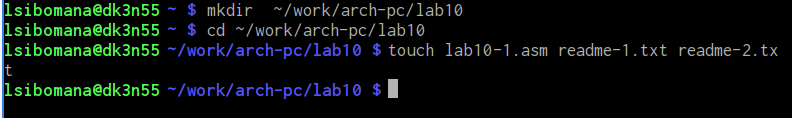
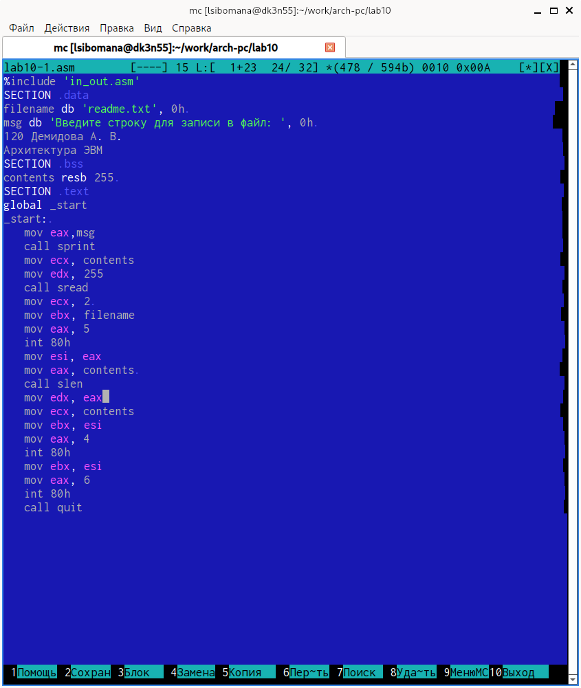
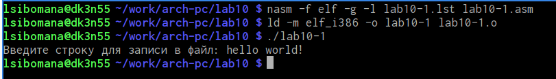
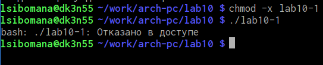
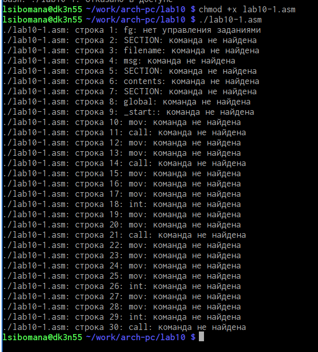
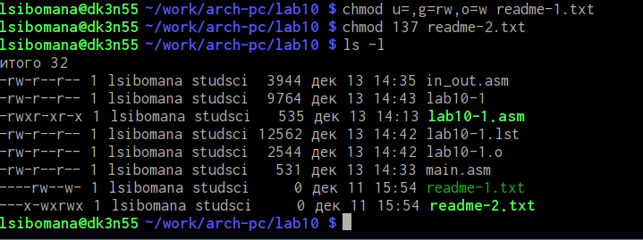
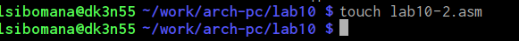
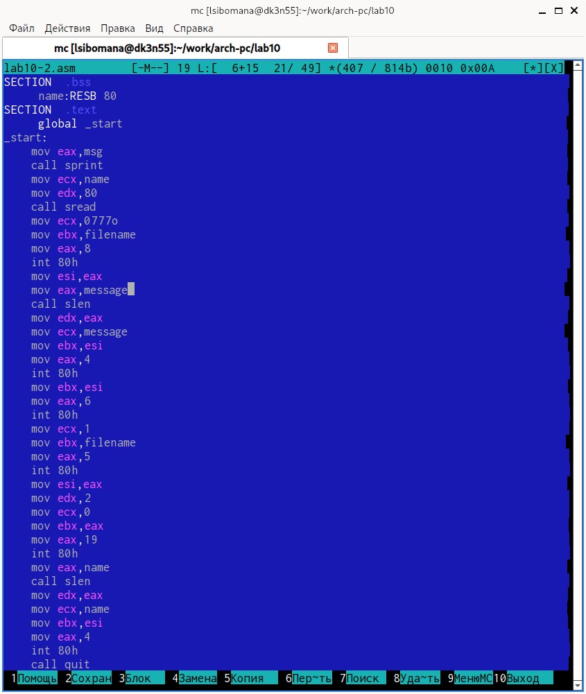
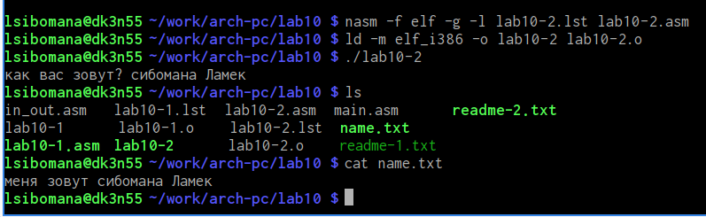

---
## Front matter
title: "Oтчёт по лабораторной работе №10"
subtitle: "Работа с файлами средствами Nasm."
author: "сибомана ламек НКАбд-03-24"

## Generic otions
lang: ru-RU
toc-title: "Содержание"

## Bibliography
bibliography: bib/cite.bib
csl: pandoc/csl/gost-r-7-0-5-2008-numeric.csl

## Pdf output format
toc: true # Table of contents
toc-depth: 2
lof: true # List of figures
lot: true # List of tables
fontsize: 12pt
linestretch: 1.5
papersize: a4
documentclass: scrreprt
## I18n polyglossia
polyglossia-lang:
  name: russian
  options:
	- spelling=modern
	- babelshorthands=true
polyglossia-otherlangs:
  name: english
## I18n babel
babel-lang: russian
babel-otherlangs: english
## Fonts
mainfont: IBM Plex Serif
romanfont: IBM Plex Serif
sansfont: IBM Plex Sans
monofont: IBM Plex Mono
mathfont: STIX Two Math
mainfontoptions: Ligatures=Common,Ligatures=TeX,Scale=0.94
romanfontoptions: Ligatures=Common,Ligatures=TeX,Scale=0.94
sansfontoptions: Ligatures=Common,Ligatures=TeX,Scale=MatchLowercase,Scale=0.94
monofontoptions: Scale=MatchLowercase,Scale=0.94,FakeStretch=0.9
mathfontoptions:
## Biblatex
biblatex: true
biblio-style: "gost-numeric"
biblatexoptions:
  - parentracker=true
  - backend=biber
  - hyperref=auto
  - language=auto
  - autolang=other*
  - citestyle=gost-numeric
## Pandoc-crossref LaTeX customization
figureTitle: "Рис."
tableTitle: "Таблица"
listingTitle: "Листинг"
lofTitle: "Список иллюстраций"
lotTitle: "Список таблиц"
lolTitle: "Листинги"
## Misc options
indent: true
header-includes:
  - \usepackage{indentfirst}
  - \usepackage{float} # keep figures where there are in the text
  - \floatplacement{figure}{H} # keep figures where there are in the text
---

# Цель работы

Приобрести навыки написания программ для работы с файлам, научиться управлять доступом к файлам.

#Содержание отчёта

Отчёт должен включать:
• Титульный лист с указанием номера лабораторной работы и ФИО студента.
• Формулировка цели работы.
• Описание результатов выполнения лабораторной работы:
– описание выполняемого задания;
– скриншоты (снимки экрана), фиксирующие выполнение заданий лабораторной
работы;
– комментарии и выводы по результатам выполнения заданий.
• Описание результатов выполнения заданий для самостоятельной работы:
– описание выполняемого задания;
– скриншоты (снимки экрана), фиксирующие выполнение заданий;
– комментарии и выводы по результатам выполнения заданий;
– листинги написанных программ (текст программ).
• Выводы, согласованные с целью работы.
Отчёт по выполнению лабораторной работы оформляется в формате Markdown. В качестве
отчёта необходимо предоставить отчёты в 3 форматах: pdf, docx и md. А также файлы с
исходными текстами написанных при выполнении лабораторной работы программ (файлы
*.asm). Файлы необходимо загрузить на странице курса в ТУИС в задание к соответствующей
лабораторной работе и загрузить на Github.

# Задание

# Выполнение лабораторной работы

Создаем каталог для программ ЛБ10, и в нем создаем файлы (рис. [@fig:001]). 

{#fig:001 width=70%}

Открываем файл в Midnight Commander и заполняем его в соответствии с листингом 10.1 (рис. @fig:002).

{#fig:002 width=70%}

Создаем исполняемый файл и запускаем его (рис. @fig:003).

{#fig:003 width=70%}

Изменяем права доступа к файлу, запретив его выполнение. Пробуем запустить файл (рис. @fig:004).

{#fig:004 width=70%}

Выдало: отказано в доступе. Значит мы поставили правильный запрет на выполнение.

Изменяем права доступа к файлу с исходным текстом программы, добавив права на исполнение. Пробуем запустить файл (рис. @fig:005).

{#fig:005 width=70%}

lab10-1.asm является файлом с исходным кодом программы на языке ассемблера, искусственно добавление права на исполнение не даст ожидаемого результата. Такие файлы нужно компилировать или ассемблировать в машинный код, а затем выполнять.

ВАРИАНТ 5

Предоставляем права доступа к 2ум файлам, согласно варианту 5 в символьном и двоичном виде, затем проверяем работу команд. (рис. @fig:006).

{#fig:006 width=70%}

#Задание для самостоятельной работы

Создаем новый файл (рис.[ @fig:007]).

Создаем файл командой touch
{#fig:007 width=70%}

Пишем программу, которая выполнит представленный список действий (рис. @fig:008).

{#fig:008 width=70%}

Создаем исполняевый файл и запускаем его, после этого проверяем создался ли новый файл, затем смотрим, как он заполнен (рис. @fig:009).

{#fig:009 width=70%}

# Выводы

Мы научились писать программы для работы с файлам и научились предоставлять права доступа к файлам.

